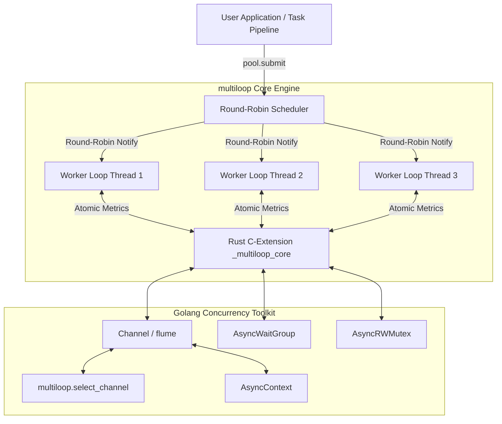

# multiloop: Multi-Event-Loop Engine & Concurrency Toolkit for Python 3.14t

[](https://github.com/hankaihong1/multiloop/actions/workflows/ci.yml)
[](https://www.python.org/)
[](https://www.rust-lang.org/)
[](LICENSE)

> ⚡ **A high-performance multi-event-loop concurrency engine and Go-style concurrency toolkit for Python 3.14t (Free-Threaded / No-GIL), powered by an ultra-fast Rust core.**

**[中文版 (Chinese)](README_ZH.md)**

---

## Table of Contents

- [1. Installation](#1-installation)
- [2. Multi-Core Performance & Benchmarks](#2-multi-core-performance--benchmarks)
- [3. Python API Usage](#3-python-api-usage)
- [4. Architecture & Developer Guide](#4-architecture--developer-guide)
- [5. Miscellaneous & Community](#5-miscellaneous--community)

---

## 1. Installation

### Prerequisites

- **Python 3.14+**: Free-Threaded (no-GIL) build, e.g. `python3.14t`.
- **Rust Toolchain**: Stable (via [rustup](https://rustup.rs)) to compile the `_multiloop_core` Rust extension.

### Install with uv (Recommended)

```bash
# Add multiloop to your project
uv add multiloop

# Or install into the current active virtual environment
uv pip install multiloop
```

### Install with pip

```bash
pip install multiloop
```

### Build from source

```bash
# Clone and compile optimized release extension via maturin
git clone https://github.com/hankaihong1/multiloop.git
cd multiloop
maturin develop --release
```

---

## 2. Multi-Core Performance & Benchmarks

### Multi-Core Throughput (Python 3.14t)

`multiloop` achieves true physical multi-core scalability without GIL bottlenecks across isolated event loops.

*Multi-core scheduling and throughput benchmarks on Apple M1 (8 Cores, 8GB RAM, Python 3.14.6 Free-Threaded No-GIL, release build):*

| Workload (Benchmark Scenario) | 1 Worker Loop | 4 Worker Loops | 8 Worker Loops | Max Speedup |
|---|---|---|---|---|
| **CPU-bound Dispatch (40 × 2M ops)** | 2.88 s | 0.79 s | **0.60 s** | **4.83x** |
| **Cross-Thread Channel Ping-Pong (100k)** | 185k msgs/s | 340k msgs/s | **410k msgs/s** | **2.21x** |

### Reproducing Benchmarks

Run the built-in multi-thread benchmark suite to measure physical multi-core throughput:

```bash
# Measure multi-thread loop pool scaling
uv run python benchmarks/bench_multithread_loops.py

# Measure lock-free work stealing channel pull throughput
uv run python benchmarks/benchmark_pull_model.py
```

---

## 3. Python API Usage

### 1. Multi-Core Thread Pool

```python
import asyncio
import multiloop


async def heavy_task(x: int) -> int:
    await asyncio.sleep(0.01)
    return x * 2


async def main() -> None:
    # async with manages the pool lifecycle automatically
    async with multiloop.EventLoopThreadPool(num_threads=4) as pool:
        # submit() round-robins across workers with work stealing
        fut = pool.submit(heavy_task, 42)
        result = await fut
        print(f"Computed result: {result}")


if __name__ == "__main__":
    asyncio.run(main())
```

### 2. Go-Style Channels & select_channel

```python
import asyncio
import multiloop


async def main() -> None:
    ch1 = multiloop.Channel(maxsize=10)
    ch2 = multiloop.Channel(maxsize=10)

    async def producer() -> None:
        await ch1.send("Message from Worker A")

    asyncio.create_task(producer())

    # select_channel waits for the first channel that becomes ready
    selected_ch, val = await multiloop.select_channel(ch1, ch2)
    print(f"Received: {val}")


if __name__ == "__main__":
    asyncio.run(main())
```

### 3. Task Synchronization with AsyncWaitGroup

```python
import asyncio
import multiloop


async def worker(name: str, wg: multiloop.AsyncWaitGroup) -> None:
    try:
        await asyncio.sleep(0.02)  # simulated asynchronous work
        print(f"worker {name} done")
    finally:
        wg.done()  # decrement counter safely on completion or error


async def main() -> None:
    wg = multiloop.AsyncWaitGroup()

    # Dispatch 5 tasks across a 4-thread pool
    async with multiloop.EventLoopThreadPool(num_threads=4) as pool:
        for i in range(5):
            wg.add()  # increment counter
            pool.submit(worker, f"task-{i}", wg)

        # Block until all tasks finish (counter reaches zero)
        await wg.wait()
        print("All workers finished cleanly!")


if __name__ == "__main__":
    asyncio.run(main())
```

### 4. Structured Concurrency with TaskGroup

```python
import asyncio
import multiloop


async def fetch(name: str, delay: float) -> str:
    await asyncio.sleep(delay)  # simulated network latency
    return f"{name}: ok"


async def main() -> None:
    try:
        # fail_after sets an overall deadline for the entire taskgroup
        async with multiloop.fail_after(0.1):
            async with multiloop.TaskGroup() as tg:
                h1 = tg.start_soon(fetch, "fast", 0.01)
                h2 = tg.start_soon(fetch, "slow", 0.5)

            print(await h1, "|", await h2)
    except TimeoutError:
        print("Timed out: child tasks cancelled safely")


if __name__ == "__main__":
    asyncio.run(main())
```

Explore more standalone scripts in [`examples/`](examples/README.md).

---

## 4. Architecture & Developer Guide

### Core Architecture

`multiloop` assigns an isolated `asyncio` event loop to each worker OS thread, backed by lock-free task queues and padded atomic metrics in Rust:



### Local Development & Testing Gates

```bash
# 1. Build and install release Rust extension
make develop

# 2. Run all linter & type checks (0 warnings, strict typing)
make lint

# 3. Run complete test suite (320+ tests)
make test
```

---

## 5. Miscellaneous & Community

### Formal Concurrency Guarantees

| Invariant / Primitive | Physical Concurrency Guarantee | Underlying State Machine |
|---|---|---|
| Python 3.14t Free-Threading | Physical multi-core parallelism across isolated event loops | Lock-free Rust queues + OS mutex protected waiter lists |
| `Barrier` Cancellation | Auto-healing: cancelled party immediately breaks round & wakes all waiters | Monotonic generation counter + atomic `_broken` state machine |
| `select_channel` Arbitration | 100% deterministic arbitration without message loss or starvation | Two-phase arbiter: uniform random probe + single-arbiter registration |
| Waiter Unregistration | $O(1)$ constant time cancellation per waiter | `collections.OrderedDict` hash lookup & removal |
| `AsyncContext.cancel()` | Directly cancels active coroutines on worker OS threads | Injected `CancelScope` cross-thread cancellation |
| `CancelScope` Shielding | Zero-leak symmetric cancellation accounting | CPython 3.11+ `task.cancelling()` snapshot & restore |

For formal invariants and concurrency design principles, see [docs/CONCURRENCY.md](docs/CONCURRENCY.md).

### Community & License

- Complete API Reference: [docs/API.md](docs/API.md)
- Choosing Primitives Guide: [docs/CHOOSING.md](docs/CHOOSING.md)
- [CONTRIBUTING.md](CONTRIBUTING.md) — Contribution Guide
- [CHANGELOG.md](CHANGELOG.md) — Changelog
- [SECURITY.md](SECURITY.md) — Security Policy
- [CODE_OF_CONDUCT.md](CODE_OF_CONDUCT.md) — Code of Conduct
- [AGENTS.md](AGENTS.md) — AI Development Guide
- **License**: MIT License. See [LICENSE](LICENSE) for details.
