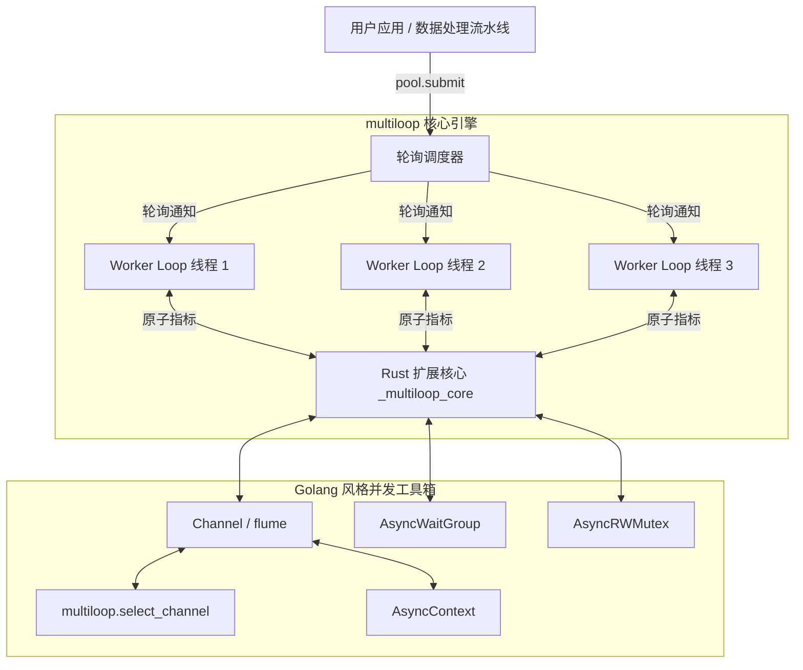

# multiloop: 面向 Python 3.14t 的多事件循环并发引擎与工具包

[](https://github.com/hankaihong1/multiloop/actions/workflows/ci.yml)
[](https://www.python.org/)
[](https://www.rust-lang.org/)
[](LICENSE)

> ⚡ **专为 Python 3.14t（Free-Threaded / No-GIL 无全局解释器锁）设计的高性能多事件循环并发引擎与 Go 风格并发工具包，底层由超高性能 Rust 核心驱动。**

**[English Version (英文原版)](README.md)**

---

## 目录

- [1. 安装指南](#1-安装指南)
- [2. 性能指标与基准测试](#2-性能指标与基准测试)
- [3. 核心 API 编程用法](#3-核心-api-编程用法)
- [4. 架构原理与开发者指南](#4-架构原理与开发者指南)
- [5. 社区生态与附录](#5-社区生态与附录)

---

## 1. 安装指南

### 前置环境要求

- **Python 3.14+**：自由线程（no-GIL）构建版本，例如 `python3.14t`。
- **Rust Toolchain**：Stable 版本（通过 [rustup](https://rustup.rs) 安装），用于从源码编译 `_multiloop_core` 扩展。

### 使用 uv 极速安装 (推荐)

```bash
# 将 multiloop 添加到项目中
uv add multiloop

# 或直接安装到当前激活的虚拟环境中
uv pip install multiloop
```

### 使用 pip 安装

```bash
pip install multiloop
```

### 从源码编译安装

```bash
# 克隆仓库并通过 maturin 编译 release 扩展
git clone https://github.com/hankaihong1/multiloop.git
cd multiloop
maturin develop --release
```

---

## 2. 性能指标与基准测试

### 多物理核高并发吞吐实测

`multiloop` 在无 GIL 锁环境下实现物理多核算力的线性扩展与高并发跨 Loop 任务通信。

*在 Apple M1（8 核心、8GB 内存、Python 3.14.6 Free-Threaded No-GIL 纯线程环境，release 编译模式）下的多核调度与吞吐指标：*

| 工作负载 (Benchmark 压测场景) | 1 个 Worker Loop | 4 个 Worker Loop | 8 个 Worker Loop | 最高加速比 |
|---|---|---|---|---|
| **CPU 密集任务调度 (40 × 200 万次运算)** | 2.88 s | 0.79 s | **0.60 s** | **4.83x** |
| **跨线程通道收发吞吐 (100k 消息)** | 185k msgs/s | 340k msgs/s | **410k msgs/s** | **2.21x** |

### 一键复现基准测试

运行内置的多线程基准压测套件测量真实物理多核吞吐：

```bash
# 测量多线程事件循环池扩展比
uv run python benchmarks/bench_multithread_loops.py

# 测量无锁工作窃取通道吞吐
uv run python benchmarks/benchmark_pull_model.py
```

---

## 3. 核心 API 编程用法

### 1. 顶层零配置多核线程池

```python
import asyncio
import multiloop


async def heavy_task(x: int) -> int:
    await asyncio.sleep(0.01)
    return x * 2


async def main() -> None:
    # async with 自动管理线程池完整生命周期
    async with multiloop.EventLoopThreadPool(num_threads=4) as pool:
        # submit() 在各 worker 间执行轮询分发与工作窃取
        fut = pool.submit(heavy_task, 42)
        result = await fut
        print(f"计算结果: {result}")


if __name__ == "__main__":
    asyncio.run(main())
```

### 2. Go 风格通道通信与多路复用

```python
import asyncio
import multiloop


async def main() -> None:
    ch1 = multiloop.Channel(maxsize=10)
    ch2 = multiloop.Channel(maxsize=10)

    async def producer() -> None:
        await ch1.send("来自 Worker A 的消息")

    asyncio.create_task(producer())

    # select_channel 等待首个就绪的通道
    selected_ch, val = await multiloop.select_channel(ch1, ch2)
    print(f"接收到数据: {val}")


if __name__ == "__main__":
    asyncio.run(main())
```

### 3. 组任务并发同步

```python
import asyncio
import multiloop


async def worker(name: str, wg: multiloop.AsyncWaitGroup) -> None:
    try:
        await asyncio.sleep(0.02)  # 模拟异步处理
        print(f"worker {name} 完成")
    finally:
        wg.done()  # 完成或异常时安全递减计数器


async def main() -> None:
    wg = multiloop.AsyncWaitGroup()

    # 向 4 线程池分发 5 个任务
    async with multiloop.EventLoopThreadPool(num_threads=4) as pool:
        for i in range(5):
            wg.add()  # 递增计数
            pool.submit(worker, f"task-{i}", wg)

        # 阻塞等待所有任务全部完成（计数归零）
        await wg.wait()
        print("所有 worker 均已安全退出！")


if __name__ == "__main__":
    asyncio.run(main())
```

### 4. 结构化并发与超时控制

```python
import asyncio
import multiloop


async def fetch(name: str, delay: float) -> str:
    await asyncio.sleep(delay)  # 模拟网络延迟
    return f"{name}: ok"


async def main() -> None:
    try:
        # fail_after 为整个任务组设定统一截止时间
        async with multiloop.fail_after(0.1):
            async with multiloop.TaskGroup() as tg:
                h1 = tg.start_soon(fetch, "fast", 0.01)
                h2 = tg.start_soon(fetch, "slow", 0.5)

            print(await h1, "|", await h2)
    except TimeoutError:
        print("整体已超时：子任务已安全级联取消")


if __name__ == "__main__":
    asyncio.run(main())
```

更多可直接运行的独立示例脚本见 [`examples/`](examples/README_ZH.md)。

---

## 4. 架构原理与开发者指南

### 核心架构图

`multiloop` 为每个工作 OS 线程分配独立的 `asyncio` 事件循环，底层由 Rust 无锁任务队列与 64 字节对齐的原子计数器提供支撑：



### 本地开发与质量门禁

```bash
# 1. 编译并安装 release 优化模式的 Rust 扩展
make develop

# 2. 运行所有代码规范与静态类型检查 (0 warnings, strict typing)
make lint

# 3. 运行全量测试套件 (320+ 测试)
make test
```

---

## 5. 社区生态与附录

### 形式化并发保证

| 不变量 / 并发原语 | 物理并发保证 | 底层形式化状态机 |
|---|---|---|
| Python 3.14t 自由线程 | 跨隔离事件循环的物理多核并行 | Rust 无锁队列 + OS 互斥锁保护的等待者结构 |
| `Barrier` 取消自愈 | 取消参与方自动触发 Broken 状态并唤醒全员 | 单调递增代际计数器 + 原子 `_broken` 状态机 |
| `select_channel` 仲裁 | 100% 确定性仲裁，零消息丢失与零饥饿 | 双阶段仲裁器：均匀随机探测 + 单一仲裁注册 |
| 等待者注销复杂度 | $O(1)$ 常数时间完成单任务取消注销 | `collections.OrderedDict` 键哈希快速剔除 |
| `AsyncContext.cancel()` | 直接中断跨 OS 线程运行中的活动协程 | 任务级注入专属 `CancelScope` 跨 Loop 取消 |
| `CancelScope` 屏蔽层 | 零泄漏对称取消记账与嵌套屏蔽保护 | CPython 3.11+ `task.cancelling()` 快照与恢复 |

形式化不变量与并发设计规范请参考 [docs/CONCURRENCY_ZH.md](docs/CONCURRENCY_ZH.md)。

### 社区生态与开源协议

- 完整 API 规范手册：[docs/API_ZH.md](docs/API_ZH.md)
- 原语选型决策指南：[docs/CHOOSING_ZH.md](docs/CHOOSING_ZH.md)
- [CONTRIBUTING.md](CONTRIBUTING.md) — 开发者贡献指南
- [CHANGELOG.md](CHANGELOG.md) — 版本变更日志
- [SECURITY.md](SECURITY.md) — 安全策略
- [CODE_OF_CONDUCT.md](CODE_OF_CONDUCT.md) — 行为准则
- [AGENTS.md](AGENTS.md) — AI 开发指引
- **开源协议**：MIT License，详情参见 [LICENSE](LICENSE)。
